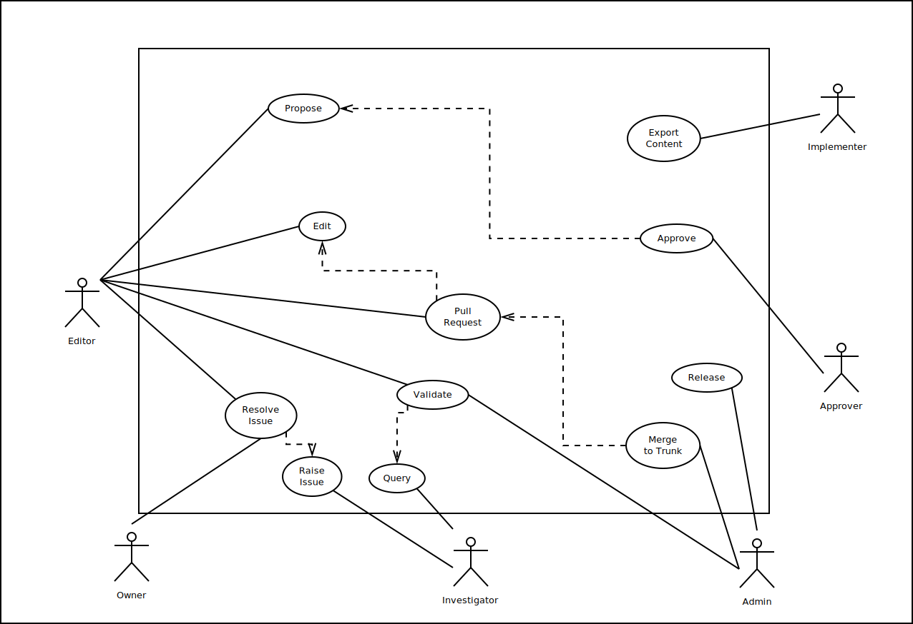

MetaRelate Use Cases
********************

The use cases for the mapping manager application are described here.  The diagram shows their relationships, with solid lines linking actors to cases and dotted arrows indicating case dependencies.

Use Cases
=========

.. toctree::
   :maxdepth: 1

   useCases/approve
   useCases/edit
   useCases/export
   useCases/mergeToTrunk
   useCases/propose
   useCases/pullRequest
   useCases/query
   useCases/raiseIssue
   useCases/release
   useCases/resolveIssue
   useCases/validate

